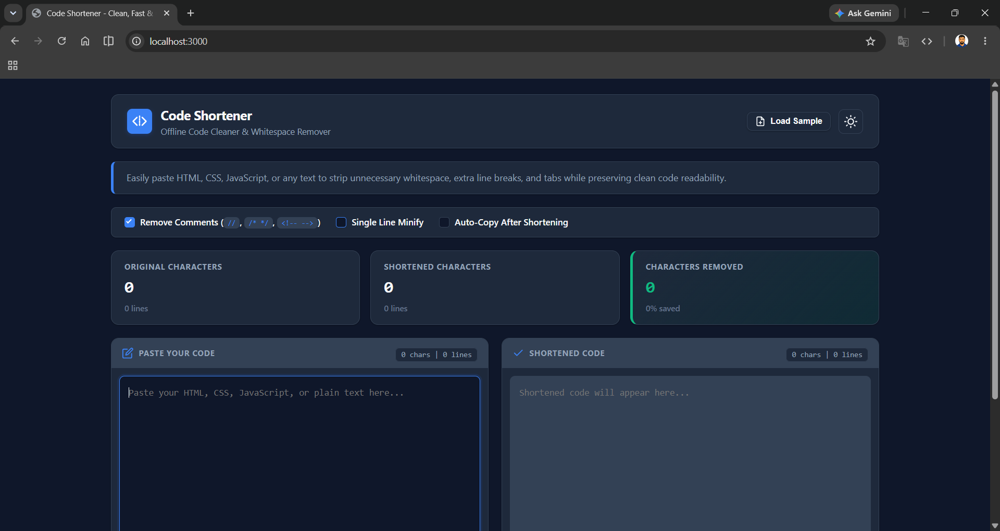
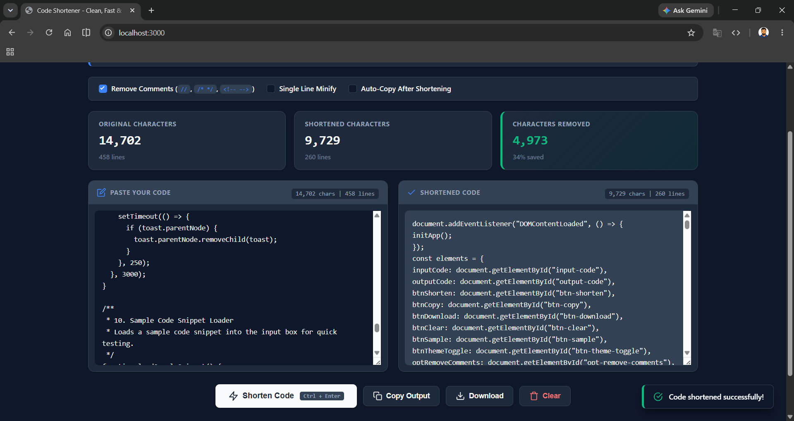

# Code Shortener

> **Clean, Fast & Offline Code Minifier** — A responsive, beginner-friendly tool to optimize HTML, CSS, JavaScript, and plain text by stripping unnecessary whitespace, extra line breaks, and tabs.

[](LICENSE)

---

## ✨ Features

- **🧹 Remove Comments** — Strip `//`, `/* */`, and `<!-- -->` comments from your code.
- **📏 Single Line Minify** — Condense multi-line code into a single compact line.
- **📊 Live Statistics** — Real-time character counts, line counts, and percentage savings.
- **📋 Auto-Copy** — Automatically copy shortened code to clipboard.
- **🌙 Dark / Light Mode** — Toggleable theme with persistent preference via `localStorage`.
- **💾 Download** — Save shortened output as a `.txt` file.
- **⌨️ Keyboard Shortcut** — Press `Ctrl + Enter` (or `Cmd + Enter` on Mac) to shorten instantly.
- **📱 Responsive** — Fully optimized for desktop, tablet, and mobile devices.
- **⚡ 100% Client-Side** — No server required; works entirely offline.
- **🔧 Zero Dependencies** — Built with vanilla JavaScript, CSS, and HTML.

---

## 🚀 Live Demo

Try the live demo:

- **Screenshot 1** — Main interface with statistics panel and dual editor layout.
- **Screenshot 2** — Dark mode view with shortened code output.

> 
> _Light mode interface showing input/output editors and statistics grid._

> 
> _Dark mode view after shortening code with comment removal enabled._

---

## 🛠️ Tech Stack

| Technology                    | Description                                                   |
| ----------------------------- | ------------------------------------------------------------- |
| **HTML5**                     | Semantic markup structure                                     |
| **CSS3**                      | Custom properties (variables), grid layout, responsive design |
| **Vanilla JavaScript (ES6+)** | No framework — lightweight and fast                           |
| **Vite**                      | Build tool and dev server                                     |
| **React 19**                  | Minimal React shell (extensible)                              |
| **Tailwind CSS v4**           | Utility-first CSS via Vite plugin                             |
| **Lucide React**              | Icon components                                               |

---

## 📦 Getting Started

### Prerequisites

- [Node.js](https://nodejs.org/) (v18 or later)
- npm or yarn

### Installation

```bash
# 1. Clone the repository
git clone https://github.com/your-username/code-shortener.git
cd code-shortener

# 2. Install dependencies
npm install

# 3. Start the development server
npm run dev
```

The app will be available at `http://localhost:3000`.

### Build for Production

```bash
npm run build
```

The output will be in the `dist/` directory, ready to deploy to any static hosting service.

---

## 🧑‍💻 Usage

1. **Paste your code** — Enter HTML, CSS, JavaScript, or plain text into the left editor.
2. **Configure options** — Check any of the following:
   - _Remove Comments_ — Strips `<!-- -->`, `/* */`, and `//` comments.
   - _Single Line Minify_ — Joins all lines into one.
   - _Auto-Copy_ — Automatically copies the output after shortening.
3. **Click "Shorten Code"** or press `Ctrl + Enter` — Your optimized code appears in the right editor.
4. **Copy or Download** — Use the toolbar buttons to copy to clipboard or download as `.txt`.
5. **Monitor stats** — The statistics panel shows original vs. shortened character/line counts and percentage saved.

### Sample Snippet

Click the **"Load Sample"** button to test the tool with a pre-built unoptimized HTML/CSS/JS snippet.

---

## ⌨️ Keyboard Shortcuts

| Shortcut                       | Action       |
| ------------------------------ | ------------ |
| `Ctrl + Enter` (Windows/Linux) | Shorten code |
| `Cmd + Enter` (Mac)            | Shorten code |

---

## 🌓 Theme

Toggle between **Light** and **Dark** mode using the moon/sun icon in the header. Your preference is saved in the browser's `localStorage` and persists across sessions.

---

## 📁 Project Structure

```
code-shortener/
├── index.html          # Main HTML entry point
├── style.css           # All styles (light/dark themes)
├── script.js           # Application logic
├── vite.config.ts      # Vite configuration
├── tsconfig.json       # TypeScript configuration
├── package.json        # Project metadata & dependencies
├── metadata.json       # Custom metadata
├── assets/
│   ├── code-shortener.mp4     # Demo video
│   ├── code-shortener1.png    # Screenshot 1 (light mode)
│   └── code-shortener2.png    # Screenshot 2 (dark mode)
└── src/
    ├── App.tsx         # React app shell
    ├── main.tsx        # React entry point
    └── index.css       # Tailwind base styles
```

---

## 🤝 Contributing

Contributions, issues, and feature requests are welcome! Feel free to check the [issues page](https://github.com/your-username/code-shortener/issues).

---

## 📄 License

Distributed under the **Apache 2.0 License**. See `LICENSE` for more information.

---

## 🙌 Acknowledgments

- Icons by [Lucide](https://lucide.dev/)
- Built with [Vite](https://vitejs.dev/)
- Inspired by developer tools that make code cleaner and more efficient.

---

<p align="center">Made with ❤️ for developers who love clean code.</p>
